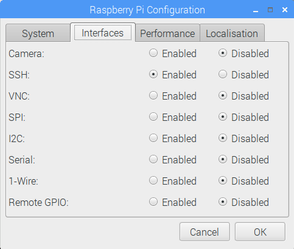

# Enviro

<b>You can sense temperature, pressure, light, local color, accelerometer readings, and magnetometer data using Enviro pHat sensors and Raspberry Pi Zero W</b>

<table><tr><td>
<a  href="https://shop.pimoroni.com/products/enviro-phat">Enviro pHat<br><br>
  </a>
  </td><td>
<a href="https://thepihut.com/collections/raspberry-pi/products/raspberry-pi-zero-w">Raspberry Pi Zero W<br><br>

</td></tr></table>

The Raspberry Pi Mega Kit includes a Raspberry Pi Zero W</a> with GPIO header attached plus a 16GB MicroSD memory card with the Raspbian operating system installed.  You can use your own memory card and <a href="https://www.raspberrypi.org/downloads/raspbian/">download and install Raspbian</a> 

## Interacting with Raspberry Pi Zero W

Use a miniHDMI-to-HDMI adaptor to connect Enviro to a monitor or TV.  Use a microUSB-to-USB adaptor to plug-in a keyboard or mouse.  I recommend a [USB hub](https://www.bestbuy.com/site/insignia-4-port-usb-3-0-hub-black/4333600.p?skuId=4333600&ref=212&loc=1&ref=212&loc=1&gclid=EAIaIQobChMI0_6gr9_P6QIVT-zjBx3WpAuAEAQYBCABEgKemvD_BwE&gclsrc=aw.ds) so you can connect both of them.  Power Raspberry Pi with a wall plug or a USB battery capable of powering mobile phones.

You can connect remotely using Secure Shell (SSH) but you must enable SSH.  Click the  raspberry icon on the menu.  Select ```Preferences```, then select ```Raspberry Pi Configuration```.  Click the ```Interfaces``` tab and enable ```SSH```.  




## Building your device

Solder a pin header to the EnviroPhat board and snap the board onto your Raspberry Pi.  Follow this [tutorial](https://learn.pimoroni.com/tutorial/sandyj/getting-started-with-enviro-phat) to install the EnviroPhat software and test your device.


## Verifying the version of Python

The Raspbian operating system comes with two versions of Python pre-installed.  This tutorial uses Python 3.  Verify that this version is installed:

```
python3 --version
$ Python 3.4.2
```

```
pip3 --version
$ pip 1.5.6 from /usr/lib/python3/dist-packages (python 3.4)
```
## Gathering data

<a href="viewData.py">Viewing sensor data</a>

## Investigating your data

[Charting EnviroPhat data on ThingSpeak](https://thingspeak.com/channels/865246)

## Known bugs

- As of October 2019, Raspberry Pi Buster operating system may have a WiFi Bug:  https://www.raspberrypi.org/forums/viewtopic.php?t=252984. 
