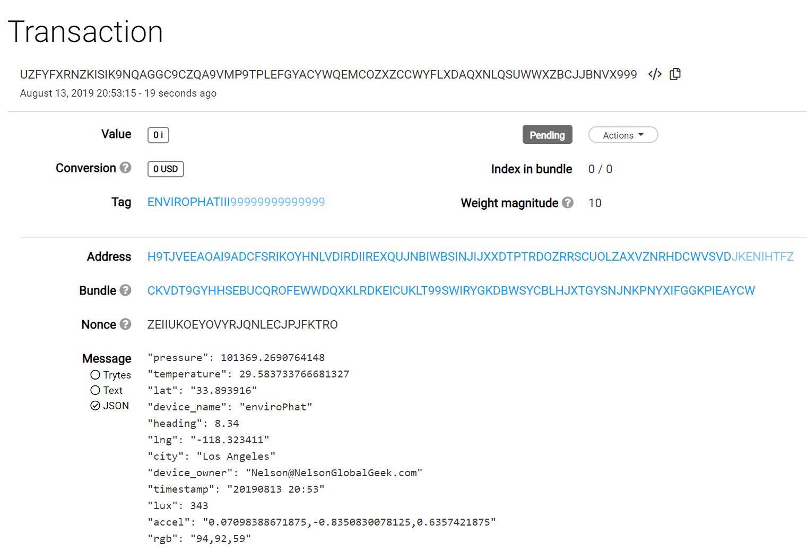

# Retrieving your data subscription

<b>This code walkthrough explains how to subscribe to EnviroPhat data published at the I3 Data Marketplace.</b>  EnviroPhat publishes environment data every 30 minutes.

## Setting up your subscription
Follow the [Connecting an IoT Device to the I3 Data Marketplace](https://github.com/NelsonPython/Connect_IoT_Device_to_I3) guide to purchase Envirophat data.  The guide also contains the I3 Marketplace IP address and port.

## Subscribing to data
```
#!/usr/bin/python

"""
Purpose:  subscribing to EnviroPhat data from I3 Marketplace
"""
```

Import the [Eclipse Paho MQTT Python client library](https://pypi.org/project/paho-mqtt/) so you can subscribe to your data
```
import paho.mqtt.client as mqtt
```
In order for your data to be meaningful, you must report the time it was sensed.  Import time and datetime libraries

```
import time
import datetime
```
Data is passed using a json format so import json libraries
```
import json
```
Import the IOTA libraries
```
from iota import Iota
from iota import ProposedTransaction
from iota import Address
from iota import Tag
from iota import TryteString
from json import load
```
### On_connect function

This function connects to the broker and prints the status of the connection
```
def on_connect(client, userdata, flags, rc):
    """ reporting IoT device connection """

    try:
        m = "Connected flags " + str(flags) + "\nResult code " + str(rc) + "\nClient_id  " + str(client)
        print(m)
        print("\n")
    except e:
        print("Hmmm I couldn't report the IoT connection: ", e)
```
### On_message function

This function receives data, stores it in csv format in the enviro.csv file, stores it on the Tangle, and prints it

```
def on_message(client, userdata, msg):
    """ receiving data"""
    try:
        sensors = msg.payload
        sensors = json.loads(sensors.decode('utf-8'))
    except e:
        print("Check the message: ",e)

    logfile = open("enviro.csv","")
    print(sensors["timestamp"], ",",\
          sensors["device_name"], ",",\
          sensors["device_owner"], ",",\
          sensors["city"], ",",\
          sensors["lng"], ",",\
          sensors["lat"], ",",\
          sensors["lux"], ",",\
          sensors["rgb"], ",",\
          sensors["accel"], ",",\
          sensors["heading"], ",",\
          sensors["temperature"], ",",\
          sensors["pressure"], file=logfile)
    logfile.close()
```
Store data on the Tangle
```    
    api = Iota('https://nodes.devnet.iota.org:443') 
    address = '999999999999999999999999999999999999999999999999999999999999999999999999999999999'
    tx = ProposedTransaction(
        address=Address(address),
        #message=TryteString.from_unicode(sensors),
        message=TryteString.from_unicode(json.dumps(sensors)),
        tag=Tag('YOURTAG'),
        value=0
    )
    print(tx)
    try:
        tx = api.prepare_transfer(transfers=[tx])
    except:
        print("PREPARE EXCEPTION",tx)
    try:
        result = api.send_trytes(tx['trytes'], depth=3, min_weight_magnitude=9)
    except:
        print("EXCEPTION", result)

    print("\nTimestamp: ", sensors["timestamp"])
    print("Device: ", sensors["device_name"])
    print("Device owner email: ", sensors["device_owner"])
    print("Device location: ", sensors["city"], " at longitude: ", sensors["lng"], " and latitude: ", sensors["lat"])
    print("Light: ", sensors["lux"])
    print("RGB: ", sensors["rgb"])
    print("Accelerometer: ", sensors["accel"])
    print("Heading: ", sensors["heading"])
    print("Temperature: ", sensors["temperature"])
    print("Pressure: ", sensors["pressure"])

    return sensors
```

### test_sub() function
This is the main loop

```
def test_sub():
    topic = "YOUR TOPIC"
    account = 'YOUR USERNAME'
    pw = 'YOUR PASSWORD'
```
Connect to the broker
```
    sub_client = mqtt.Client(account)
    sub_client.on_connect = on_connect
    sub_client.on_message = on_message
    sub_client.username_pw_set(account, pw)
    sub_client.connect('I3 MARKETPLACE IP ADDRESS', PORT, 60) #connect to broker
    sub_client.subscribe(topic)
```
This script will listen until it is interrupted.  
```
    rc = sub_client.loop_forever()
    time.sleep(1)
    print("Return code ", rc)
```
Test_sub is a loop.  It can be stopped using the keyboard interrupt, ```ctrl-c```.
```
if __name__ == '__main__':
    try:
        test_sub()
    except KeyboardInterrupt:
        rc = sub_client.loop_stop()
        print("\nI'm stopping now")
```

### Sample data subscription


