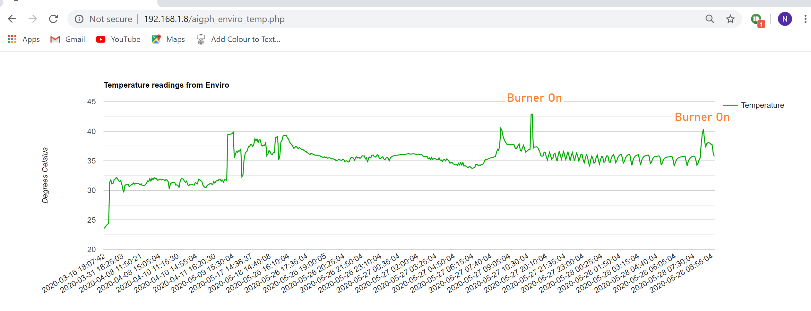
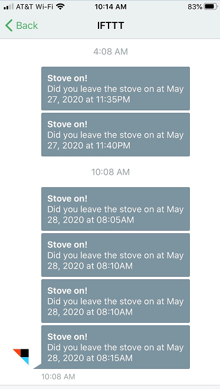

<h1>Protecting you from leaving the stove burner on</h1>


A human can get distracted and forget to turn off a burner.  To begin, Enviro is reporting a temperature change greater than 1 degree Celsius in less than 8 minutes.  This criteria indicates that a burner may have been left on.  In the future, Enviro can improve this criteria based on feedback.



When Enviro determines that a burner has been left on, it sends a text.  It uses IFTTT Webhooks along with Pushbullet so you must install the Pushbullet app to get the text.



<h3>Warning</h3>
Enviro was not designed to sit beside the burner.  It is not waterproof and could be damaged when you cook.  I hung my sensor in a plastic bag without ziplocking it so the device will not overheat.  This is a temporary solution while I run experiments.


<h3>heatAlert.py</h3>

This script checks the temperature and determines whether the burner has been left on.  In the future, it will learn the best criteria

```
import time
from datetime import datetime
import csv
import textKitchen_TOO_HOT

dt = datetime.now()
priorTemp = 0.0
with open('enviro.csv') as csvfile:
        sense = csv.reader(csvfile)
        for row in sense:
                rowDT = datetime.strptime(row[11],'%y-%m-%d %H:%M')
                temperature = float(row[8])
                if temperature - priorTemp > 1:

                        diff = dt - rowDT
                        diffMinutes = (diff.days *24*60)+(diff.seconds/60)
                        if diffMinutes < 8:
                                print(diffMinutes)

                                msg = "HEAT ALERT\nTemperature is: "+ \
                                str(round((temperature*9/5)+32))+" F "+ \
                                str(round(temperature))+" C"
                                print(msg)
                                print(rowDT)
                                print(dt)
                                textKitchen_TOO_HOT.textIt(msg)

                priorTemp = temperature
```

<h3>textKitchen_TOO_HOT</h3>

This script sends a text.  <a href="https://thepihut.com/blogs/raspberry-pi-tutorials/using-ifttt-with-the-raspberry-pi">Using IFTTT with Raspberry Pi</a> is a helpful tutorial for setting up Webhooks and Pushbullet

```
import requests

def textIt(msg):
        '''
        PURPOSE:  Text using IFTTT.com
                  you need your own API KEY
        '''
        try:
                r = requests.post(url="https://maker.ifttt.com/trigger/Kitchen_TOO_HOT/with/key/YOUR KEY HERE", data={"value1": msg})
                print("Text status ", r.status_code, r.reason)
        except:
                print("Text status ", r.status_code, r.reason)

if __name__=="__main__":
        textIt(msg)
```


