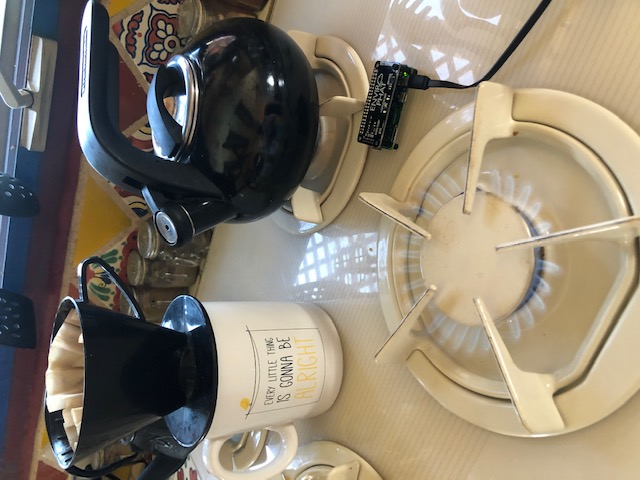
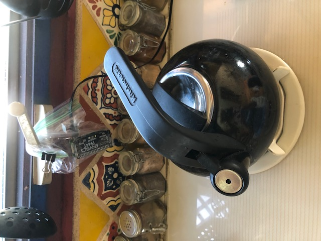

<h1>Protecting you from leaving the stove burner on</h1>

It can be easy to get distracted and forget to turn off a burner.  Enviro can sense the temperature change when the burner is on.  

It is programming to send a text using IFTTT webhooks along with pushbullet

<h3>Warning</h3>
Enviro was not designed to sit beside the burner.  It is not waterproof and could be damaged when you cook.  I hung my sensor in a plastic bag without ziplocking it so the device will not overheat.  This is a temporary solution while I run experiments.

